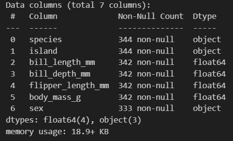

# Fundamentals-of-Data-Analysis-Tasks

This repository is used for the task given by the lecture on
Fundamentals of Data Analaysis module on Higher Diploma in Science in Computing in Data Analytics at ATU.  
___
### Source 

### Programing Language 
* [Python](https://www.python.org/)

## Important Library 
* random
* pandas 
* matplotlib. pyplot 
* random 

### Technologies 
* Visual Studio Code
* The Jupyter Notebook
* Cmder git

1. The Collatz conjecture is a famous unsolved problem in mathematics. 
The problem is to prove that if you start with any positive
integer x and repeatedly apply the function f(x) below, you al-
ways get stuck in the repeating sequence 1, 4, 2, 1, 4, 2, . . .
Your task is to verify, using Python, that the conjecture is true for
the first 10,000 positive integers.

# 2. Give an overview of the famous penguins data set, explaining the types of variables it contains. Suggest the types of variables that should be used to model them in Python, explaining your rationale.

The penguins data set has 7 columns and 344 rows.

 

The dataset inclueds the following types of variables: 

Categorical Variables:

  * Species: the varibales represent the species of the penguin (Adelie, Chinstrap, Gentoo)
  * Island:the variable represent the island where the penuin was observed (Torgersen, Dream, Biscoe)
  * Sex: represent the gender of the penguin (Male or Femal)

All categorical variables are continuous 

Numeric Variables:

* Bill Length : the variable represents the length of the penguin's beak in millimeters(mm). This varibale is continuous numeric variable    
* Bill Depth: the variable represents the depth of the penguin's beak in millimeters(mm)
* Flipper Length: represents the penguis's fin in milimiters (mm)
* Body Mass : the variable represnets the penguin's body weight in grams (g)

3. For each of the variables in the penguins data set, suggest what 
probability distribution from the numpy random distributions list
is the most appropriate to model the variable.

4. Suppose you are flipping two coins, each with a probability p of
giving heads. Plot the entropy of the total number of heads versus
p.

5. Create an appropriate individual plot for each of the variables in
the penguin data set.